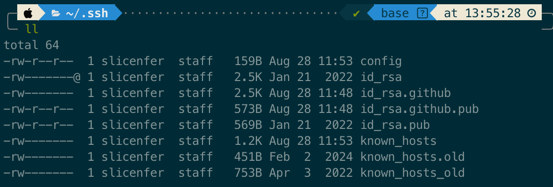

# MacOS配置多SSH Key
## 为什么
公司使用 Gitlab，我个人使用 Github，这样就需要一台电脑配两个密钥，而如果不进行特殊处理，每次生成的id_rsa文件名是重复的导致会覆盖之前的配置，无法满足我的需求。
## 如何做
### 生成两个/多个密钥
```Bash
cd ~/.ssh
# 生成用于 github 的密钥
ssh-keygen -t rsa -f ~/.ssh/id_rsa.github -C "xxx@gmail.com"
# 生成用于公司 gitlab 的密钥
ssh-keygen -t rsa -f ~/.ssh/id_rsa -C "xxx@corporation.com"
```
此时，在.ssh目录下大致存在如下文件

### 注册密钥到ssh-agent
```Bash
# 注册
ssh-add -K ~/.ssh/id_rsa
ssh-add -K ~/.ssh/id_rsa.github
# 查看确认
ssh-add -l
# 创建配置文件
cd ~/.ssh
touch config
# 编辑配置文件
vim config
```
编辑内容如下
```Bash
# 平台地址
Host git@github.com
# 别名
HostName github
# 用户名随便起
User github
# 密钥文件所在路径
IdentityFile ~/.ssh/id_rsa.github

Host git@git.demo.com
HostName demo
User demo
IdentityFile ~/.ssh/id_rsa
```
### 测试
```Bash
ssh -T git@github.com
ssh -T git@git.demo.com
```